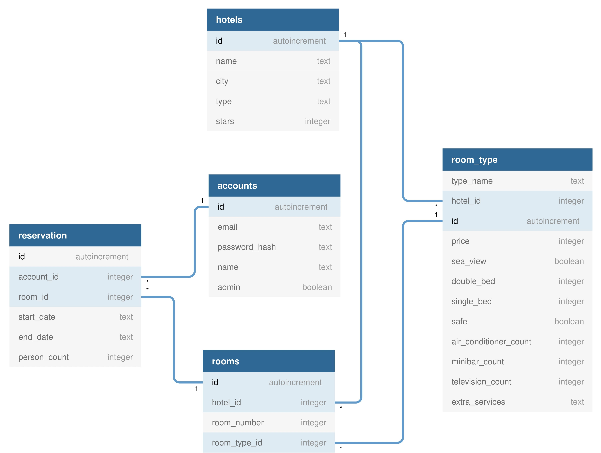

## Diagrams

### *Structure Diagram* of Classes
- Using UML 2 notation.

### Database Structure for Modeling
- Using MVC Design Pattern with SQLite3.

### RFC5322 Regex Diagram
- Source: [emailregex.com](https://emailregex.com)

