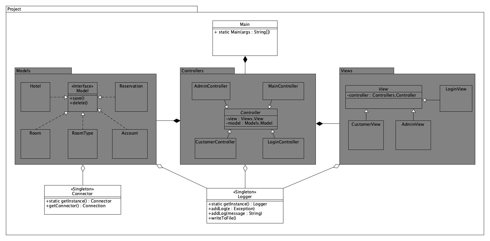

## Project 2

- Using [`Java and JDK 11.`](https://www.oracle.com/technetwork/java/javase/downloads/jdk11-downloads-5066655.html)
- Description
	- [PDF](./DESCRIPTION.pdf)
	- [MarkDown](./DESCRIPTION.md)
- References: [MarkDown](./REFERENCES.md)

### Contributors / Students

- Mert Dede
    - GitHub: [`Anaxilaus`](https://github.com/Anaxilaus)
    - No: `2016280010`

- Uluğbey Alp
    - GitHub: [`UlugbeyAlp`](https://github.com/UlugbeyAlp)
    - No: `2016280002`
    
Team name: `MU.` Stands for `M`ert and  `U`luğbey.

## Diagrams

### *Structure Diagram* of Classes
- Using UML 2 notation.

### Database Structure for Modeling
- Using MVC Design Pattern with SQLite3.

